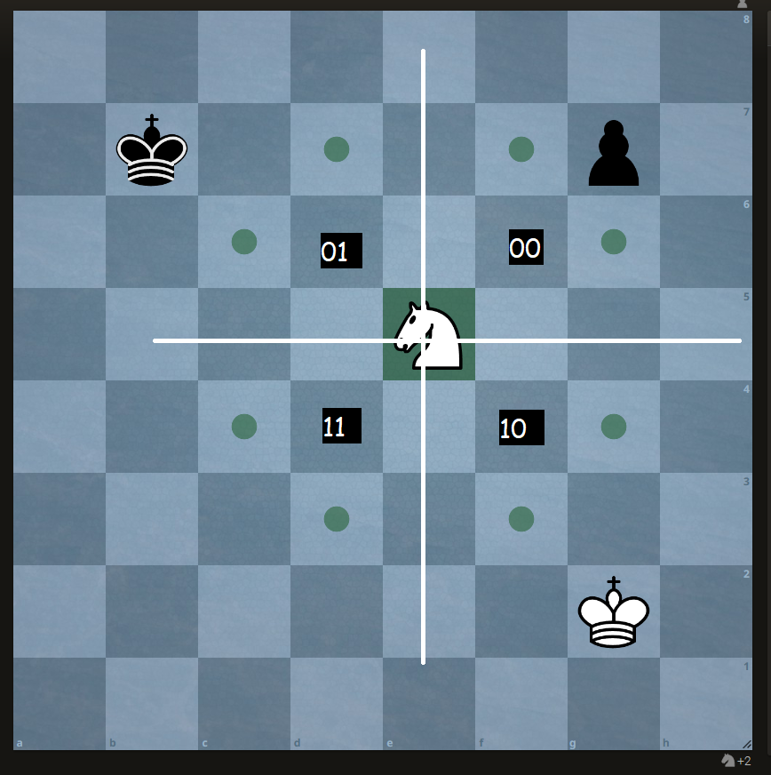

# Shortest Paths for Knight's Tour Problem with Classes with easy setup!

This program finds all shortest paths from a starting position to an ending position on a chessboard using the Knight's Tour problem algorithm, organized with classes. As the knight can only move in L shapes, so allowed steps for knight are two steps up, down and one step left or right or vice versa, depending upon the postion of the knight.

## Requirements

- [](https://www.python.org/downloads/release/python-3100/)

- `matplotlib.pyplot`
- `networkx`
- `graphviz`
- `pygraphviz`


## How to Use
- Install the dependencies by following command.
```
pip install -r requirements.txt
```
If there is error with `pygraphviz` ,specially in windows OS, then you can use `conda` command to install separately, if conda already install,  by `conda install -c anaconda pygraphviz` to properly run the 
- To Run the script use: 
```
python app.py
```
- Enter the starting position (x y) as prompted.
- Enter the ending position (x y) as prompted.
- Choose `(y/n)` if you want to save the image into `PNG` file.
- Choose  `y` if you want to continue the search.

The script will output all minimum-length sequences of knight moves from the starting position to the ending position, you can see in the command line interface. It will also generate a dot file `./artifacts/shortest_paths.dot` with the paths and display the graph using Matplotlib. You can see the latest generated image in PNG format and dot file in the folder `./artifacts`.

## Docker Run
You can also use Docker to run this script without worrying about installing dependencies, you can use the `docker-compose.yml` file to build the docker image and container, or you can build your image by `docker build -t app .` command. Follow the steps for using yml file:
1.  Build the Docker image from the Dockerfile provided:

```
docker-compose run -it app
```


3. Follow the prompts to enter the starting and ending positions. you can see the `dot` and `png` file in the `app/artifacts` folder.


## Algorithm Overview

The script employs a algorithm to find the shortest paths for the knight on a chessboard. Here's a brief overview of the algorithm used:

- *Initialization*: Initialize a priority queue to store positions, an explored set, and lists to store paths and minimum costs.
- *Exploration*: Explore positions by considering all possible moves of the knight and calculating costs.
- *Termination*: Once all positions are explored, return the shortest paths found.

## Contributing

Contributions to this project are welcome. Feel free to open issues or pull requests to suggest improvements or report bugs.


